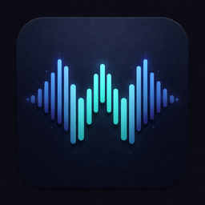

# Overwhisper

<p align="center">
  
</p>

<p align="center">
  <strong>Fast, private dictation for macOS. Free and open source.</strong>
</p>

<p align="center">
  Press a hotkey, speak, and Overwhisper inserts the text wherever your cursor is.
  It lives in the menu bar, runs local WhisperKit or Parakeet speech-to-text on
  your Mac by default, and does not ask you to rent access to hardware you
  already bought.
</p>

<p align="center">
  <a href="https://github.com/OverseedAI/overwhisper/releases/latest">Download</a>
  ·
  <a href="#features">Features</a>
  ·
  <a href="#building-from-source">Build from source</a>
  ·
  <a href="#contributing">Contribute</a>
</p>

## Why Overwhisper?

There are plenty of dictation apps that run transcription on the user's own
machine and still charge a subscription for the privilege. Overwhisper takes the
more obvious deal: your Mac does the work, so the core app is free, local-first,
and open source.

The goal is not "voice notes". The goal is to make speaking into any Mac text
field feel as direct as typing:

- Hold a hotkey while writing in Slack, Notes, Linear, your browser, or your IDE.
- Choose WhisperKit or Parakeet local models for private, low-latency
  transcription on Apple Silicon.
- Keep a polished menu bar workflow with onboarding, model management, waveform
  feedback, recent transcriptions, retry, and sensible failure handling.
- Choose cloud transcription only when you explicitly want it.

## Download & Install

1. Download the latest signed DMG from
   [GitHub Releases](https://github.com/OverseedAI/overwhisper/releases/latest).
2. Open the DMG and drag **Overwhisper.app** into `/Applications`.
3. Launch Overwhisper from Applications or Spotlight.
4. Grant the requested permissions:
   - **Microphone** records your speech.
   - **Accessibility** lets Overwhisper paste text into the app you are using.
5. Pick a model in Settings and start dictating.

Overwhisper is a menu bar app. It does not show a Dock icon.

### Requirements

- macOS 14 Sonoma or later
- Apple Silicon Mac, M1 or newer
- Microphone and Accessibility permissions

Release builds are arm64-only.

## Features

### Local-first transcription

- **WhisperKit** local transcription, optimized for Apple Silicon.
- **Parakeet** local transcription via FluidAudio, including Parakeet v2 English
  and Parakeet v3 multilingual model options.
- **OpenAI Whisper API** as an optional cloud engine when you prefer hosted
  transcription.
- Download, select, and delete local models from the settings UI.

### Built for real daily use

- **Two hotkey styles:** `Option+Space` toggles recording, and
  `Option+Shift+Space` is push-to-talk by default. Both are configurable.
- **Tap-or-hold behavior:** tap the toggle hotkey to start/stop, or hold it like
  push-to-talk and release to transcribe.
- **Cursor-aware insertion:** text is pasted into the active app, not trapped in
  a separate transcript window.
- **Floating overlay:** configurable position with live waveform and transcribing
  state.
- **Menu bar controls:** start/stop recording, copy recent transcriptions, retry
  the last failed transcription, open settings, and check for updates.
- **Input device selection:** use the system default microphone or choose a
  specific input device.

### Quality-of-life tools

- **Custom vocabulary** for names, acronyms, and project-specific terms.
- **Text replacements** for fixing predictable mishearings, like
  `Cloud Code -> Claude Code`.
- **Language selection** with auto-detect, common Whisper languages, and
  Parakeet language hints.
- **Translate to English** when using a model/API mode that supports translation.
- **Silent recording detection** so accidental empty captures can be skipped.
- **Optional recording limit** for long-running hotkey mistakes.
- **Optional system-audio mute** while recording with built-in speakers.
- **Recent transcription history** and local debug sessions for playback, retry,
  and troubleshooting.
- **Sparkle updates** for signed release builds.

## How It Works

1. Focus any text field.
2. Press your Overwhisper hotkey.
3. Speak naturally.
4. Release the push-to-talk hotkey, or press the toggle hotkey again.
5. Overwhisper transcribes the audio and inserts the result at the cursor.

If Accessibility permission is missing, Overwhisper copies the text to the
clipboard and tells you to paste manually.

## Privacy

Overwhisper is local-first.

- Audio stays on your Mac when using WhisperKit or Parakeet.
- Audio is sent to OpenAI only when the OpenAI engine is selected, or when cloud
  fallback has been enabled in local settings and a local transcription fails.
- OpenAI API keys are stored in the macOS Keychain.
- Recent debug sessions are stored locally under Application Support so you can
  inspect audio, retry failures, and troubleshoot issues. The app keeps a capped
  set of recent sessions and includes a Clear All control in Settings.
- Overwhisper does not include analytics or tracking.

## Building From Source

Requires Xcode 15+ and Swift 5.9+.

```bash
swift build
swift run Overwhisper
```

Or use the Justfile:

```bash
just build          # debug build
just run            # run debug build
just build-release  # release build
just bundle         # create Overwhisper.app
```

For Xcode:

```bash
open Package.swift
```

When running inside Codex or another Seatbelt sandbox, SwiftPM may fail while
trying to create its own nested sandbox or write shared caches. Use:

```bash
swift build --disable-sandbox --cache-path .swiftpm-cache
```

## Project Structure

```text
Overwhisper/
├── App/              # App delegate, app state, onboarding, crash handling
├── Audio/            # AVAudioEngine recording and device handling
├── Hotkey/           # Global keyboard shortcuts via HotKey
├── Logging/          # App logs and local debug session storage
├── Output/           # Clipboard + synthetic Cmd+V text insertion
├── Resources/        # App icon and bundled assets
├── Transcription/    # WhisperKit, Parakeet, and OpenAI engines
└── UI/               # Settings, overlay, menu bar icon, debug playback
```

The core recording flow is:

1. `HotkeyManager` receives the global hotkey event.
2. `AudioRecorder` records a 16 kHz mono WAV through `AVAudioEngine`.
3. `OverlayWindow` shows recording and transcribing state.
4. The selected `TranscriptionEngine` produces text.
5. `TextInserter` pastes the final text into the active app.

## Dependencies

- [WhisperKit](https://github.com/argmaxinc/WhisperKit) for local Whisper models.
- [FluidAudio](https://github.com/FluidInference/FluidAudio) for Parakeet ASR.
- [HotKey](https://github.com/soffes/HotKey) for global shortcuts.
- [Sparkle](https://github.com/sparkle-project/Sparkle) for app updates.

## Contributing

Contributions are welcome. Useful areas include:

- Dictation UX polish and reliability.
- Model download and setup experience.
- Better language/model documentation.
- Accessibility and permission-flow improvements.
- Bug reports with macOS version, Mac model, selected engine/model, and the
  relevant error from the menu bar or History tab.

Please keep changes focused, use the existing SwiftUI/SwiftPM style, and prefer
small pull requests that are easy to review.

## Support

Overwhisper is free and open source. If it saves you time and you want to support
development, you can do that at
[buymeacoffee.com/halshin](https://buymeacoffee.com/halshin).

## License

MIT. See [LICENSE](LICENSE).
